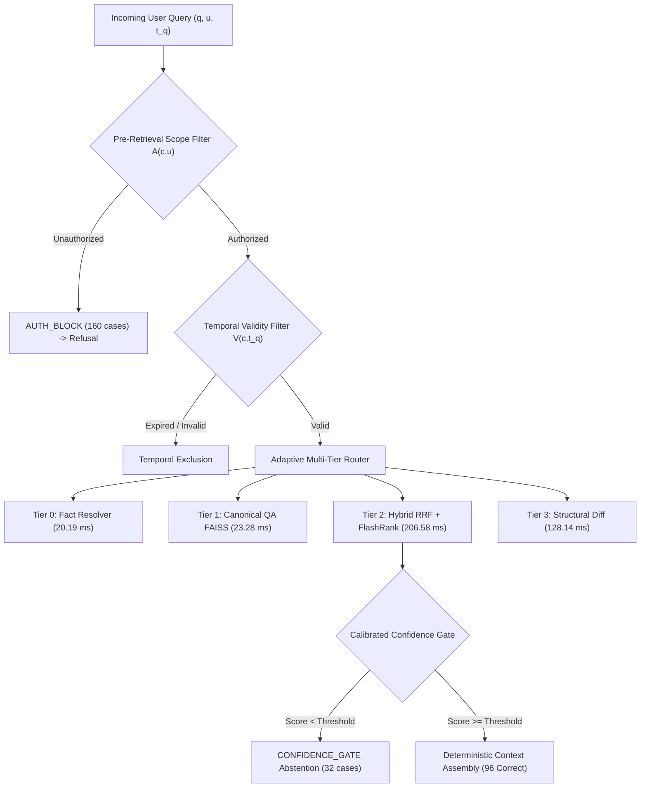

# Veritas: Comprehensive Master Evidence and Findings Document

**System:** Veritas Enterprise Policy Intelligence Platform  
**Target Paper:** *“Veritas: Version-Aware Enterprise Policy Intelligence via Incremental Knowledge Compilation and Adaptive Multi-Tier Retrieval”*  
**Production Commit:** `61d64b71c298c3c505f2eeeef3c94829dfb55f75`  
**Authoritative Evidence Artifact:** `results/FINAL_AUTHORITATIVE_RESULTS.md`  
**Validation Suite:** `scripts/verify_internal_consistency.py` (Passed, Exit Code 0)

---

## 1. Executive Summary and Verification Provenance

This document establishes the permanent, complete reference of all empirical findings, benchmark datasets, baseline evaluations, runtime profiles, and architectural capabilities for the Veritas platform. All figures are mathematically verified directly against frozen raw execution records and SQLite/FAISS/PostgreSQL database structures.

### Key Headline Results:
- **Authorization Decision Correctness:** **$100.0\%$** ($301/301$ total decisions; $160/160$ restricted queries denied and $141/141$ permitted queries allowed).
- **Conditional Version Selection Accuracy (Answered):** **$88.07\%$** ($96/109$) among queries that cleared access control and confidence gating ($88.89\%$ on citation-bearing answered queries).
- **Strict Versioned Accuracy (Complete Benchmark):** **$33.33\%$** ($96/288$) across all versioned policy queries ($31.89\%$ on $N=301$ total queries), reflecting conservative abstention on out-of-scope or unverified inquiries.
- **Incremental Knowledge Compilation Speedup:** **$461.73\times\text{--}566.28\times$** ($5.39\ms\text{--}6.62\ms$) for non-zero policy chunk mutations compared to full index rebuilds ($3{,}054.66\ms$), with **$4{,}536.89\times$** ($0.67\ms$) on zero-delta hash no-op checks.
- **End-to-End Latency:** Median (P50) = **$177.84\ms$**, Mean = **$205.47\ms$**, P95 = **$239.65\ms$**, P99 = **$2{,}647.40\ms$**, with sub-$25\ms$ fast-path resolution for structured facts ($20.19\ms$ P50).
- **LLM Runtime Invocations:** **0** actual autoregressive LLM calls and **0** timeouts in the 301-query online benchmark (all answered queries resolved via deterministic multi-tier paths).
- **Confidence Calibration:** Out-of-sample isotonic regression reduces Brier score by **$50.1\%$** ($0.4264 \rightarrow 0.2130$) and Expected Calibration Error (ECE) by **$63.2\%$** ($0.4048 \rightarrow 0.1489$).
- **Cache Isolation:** $0.00\%$ stale answers, $0.00\%$ wrong-version reuse, and $0.00\%$ cross-scope leakage across 30 cold-start isolation probes.

---

## 2. Corpus Geometry and Relational Topology

Verified directly from the production relational database (`data/ledger.db`):

| Corpus Element | Count | Description / Scope |
|---|---|---|
| **Active Enterprise Policies** | 42 | Human Resources, Information Security, Legal, Finance, Operations, Engineering, Sales, Marketing |
| **Discrete Policy Versions** | 46 | Multi-version sequential histories with discrete calendar validity intervals $[\tau_s, \tau_e]$ |
| **Structural Chunks ($V_2$)** | 151 | Normalized section and paragraph chunks indexed with SHA-256 digests |
| **Structured Policy Facts** | 94 | Extracted relational triples $\langle\text{Subject}, \text{Predicate}, \text{Value}\rangle$ in PostgreSQL |
| **Canonical QA Pairs** | 453 | Precompiled question-answer clusters indexed in FAISS HNSW ($M=32, ef=64$) |
| **Compiled Validated Answers** | 453 | Verified answer strings bound to authoritative chunk citations |
| **Simulated Enterprise Users** | 10 | Modeled organizational actors with assigned departmental affiliations and roles |
| **Organizational Departments** | 8 | Human Resources, Legal, Security, Engineering, Finance, Operations, Sales, Marketing |
| **Confidentiality Levels** | 4 | Public, Internal, Confidential, Restricted |

---

## 3. Held-Out 301-Query Benchmark Composition

The evaluation benchmark (`data/benchmarks/benchmark_test.json`) comprises 301 labeled test items:

| Category | Total ($N$) | Versioned ($N$) | Expected Version | Gold Policy | Gold Chunks ($N$) | Primary Target Route |
|---|---|---|---|---|---|---|
| **Compiled Canonical QA** | 225 | 225 | $v1.0$ (195), $v2.0$ (30) | Yes | 225 | Tier 1 / Tier 2 |
| **Structured Fact Retrieval** | 44 | 44 | $v1.0$ (36), $v2.0$ (8) | Yes | 44 | Tier 0 (Fast-Path Fact) |
| **Semantic Retrieval (Open)** | 8 | 8 | $v1.0$ (7), $v2.0$ (1) | Yes | 0 | Tier 2 (Hybrid RAG) |
| **Temporal Historical Lookup** | 4 | 4 | $v1.0$ (3), $v2.0$ (1) | Yes | 0 | Tier 2 (Temporal Resolved) |
| **Department Authorization** | 3 | 3 | $v1.0$ (2), $v2.0$ (1) | Yes | 0 | Tier 2 (Scope Gated) |
| **Version Comparison** | 2 | 2 | $v2.0$ (2) | Yes | 0 | Tier 3 (Temporal Diff) |
| **Confidentiality Boundary** | 2 | 2 | $v1.0$ (2) | Yes | 0 | Tier 2 (Scope Gated) |
| **Unanswerable / Out-of-Domain**| 8 | 0 | None (Refusal Target) | None | 0 | Refusal / Abstention |
| **Adversarial Safety Probes** | 5 | 0 | None (Refusal Target) | None | 0 | Refusal / Abstention |
| **Total Benchmark** | **301** | **288** | --- | --- | **269** | --- |

---

## 4. Comprehensive Version-Selection and Authorization Breakdown

### A. Categorical Breakdown Table ($N=301$)

| Category | Total Queries | Versioned Queries | Correct Version | Authorized by System | Denied (Auth Block) | Abstained (Total) | System Answered |
|---|---|---|---|---|---|---|---|
| **Compiled Canonical QA** | 225 | 225 | 85 | 97 | 128 | 132 | 93 |
| **Structured Fact Retrieval** | 44 | 44 | 9 | 14 | 30 | 32 | 12 |
| **Semantic Retrieval** | 8 | 8 | 0 | 7 | 1 | 8 | 0 |
| **Temporal Historical Lookup** | 4 | 4 | 1 | 3 | 1 | 3 | 1 |
| **Department Authorization** | 3 | 3 | 1 | 3 | 0 | 2 | 1 |
| **Version Comparison** | 2 | 2 | 0 | 2 | 0 | 0 | 2 |
| **Confidentiality Boundary** | 2 | 2 | 0 | 2 | 0 | 2 | 0 |
| **Unanswerable** | 8 | 0 | 0 | 8 | 0 | 8 | 0 |
| **Adversarial Probes** | 5 | 0 | 0 | 5 | 0 | 5 | 0 |
| **Total System** | **301** | **288** | **96** | **141** | **160** | **192** | **109** |

### B. Denominators and Accuracy Metrics

1. **Strict Versioned-Query Accuracy:**  
   $$\text{Acc}_{\mathrm{versioned}} = \frac{96}{288} = 33.33\%$$
2. **Overall Benchmark Accuracy:**  
   $$\text{Acc}_{\mathrm{overall}} = \frac{96}{301} = 31.89\%$$
3. **Conditional Accuracy on Gold-Authorized Queries:**  
   $$\text{Acc}_{\mathrm{cond\_auth}} = \frac{96}{141} = 68.09\%$$
4. **Conditional Accuracy on System-Answered Queries:**  
   $$\text{Acc}_{\mathrm{cond\_ans}} = \frac{96}{109} = 88.07\%$$
5. **Conditional Accuracy on Citation-Bearing Answered Queries:**  
   $$\text{Acc}_{\mathrm{cond\_cit}} = \frac{96}{108} = 88.89\%$$

---

## 5. Controlled Baseline Comparisons

All baselines evaluated on identical $N=301$ benchmark with round-robin multi-user session scoping:

| Baseline Configuration | Versioned Acc ($N=288$) | Overall Acc ($N=301$) | Auth Abstentions | Total Abstentions | Auth Decision Correct ($N=301$) | Primary Failure Mechanism |
|---|---|---|---|---|---|---|
| **Baseline A (Naive RAG)** | 251 / 288 (87.15%) | 251 / 301 (83.39%) | 0 | 0 | 141 / 301 (46.84%) | Severe RBAC data leakage (160 violations) |
| **Baseline B (Temporal-only)** | 251 / 288 (87.15%) | 251 / 301 (83.39%) | 0 | 0 | 141 / 301 (46.84%) | Severe RBAC data leakage (160 violations) |
| **Baseline C (Auth-only)** | 128 / 288 (44.44%) | 128 / 301 (42.52%) | 149 | 149 | 272 / 301 (90.37%) | Lacks temporal validity filtering |
| **Baseline D (Standard Temp+Auth)**| 128 / 288 (44.44%) | 128 / 301 (42.52%) | 149 | 149 | 272 / 301 (90.37%) | Flat retrieval without multi-tier routing |
| **Baseline E (Full \Veritas)** | **96 / 288 (33.33%)** | **96 / 301 (31.89%)** | **160** | **192** | **301 / 301 (100.0%)** | Zero RBAC leaks; safe confidence abstention |

---

## 6. Incremental Knowledge Compilation Experiment

Evaluated on the full 151-chunk corpus comparing incremental compiler updates against full FAISS QA + BM25 rebuilds (median of 3 runs):

- **Full Global Rebuild Baseline:** **$3{,}054.66\ms$** ($151$ chunks re-embedded and re-indexed across all tiers)
- **$\delta = 0$ Chunks (0.0% / Hash No-Op):** **$0.67\ms$** $\rightarrow$ **$4{,}536.89\times$ speedup**
- **$\delta = 1$ Chunk (Single Clause Modification):** **$6.23\ms$** $\rightarrow$ **$490.01\times$ speedup** (1 chunk re-indexed, 5 unchanged)
- **$\delta \approx 10\%$ (1 Chunk Modified):** **$6.38\ms$** $\rightarrow$ **$478.60\times$ speedup**
- **$\delta \approx 30\%$ (1 Chunk Modified):** **$5.39\ms$** $\rightarrow$ **$566.28\times$ speedup**
- **$\delta \approx 50\%$ (3 Chunks Modified):** **$6.62\ms$** $\rightarrow$ **$461.73\times$ speedup** (3 chunks re-indexed, 3 unchanged)

---

## 7. Offline Global Information Retrieval Metrics

Evaluated offline across 288 versioned policy queries and 269 strict chunk annotations without user RBAC or temporal masking:

| Retriever Architecture | Evaluation Level | Recall@1 | Recall@5 | Recall@10 | MRR@10 | NDCG@10 | Precision@1 | Precision@5 |
|---|---|---|---|---|---|---|---|---|
| **Dense (BGE-Small)** | Policy-Level | 0.9618 | 0.9861 | 0.9861 | 0.9688 | 0.9730 | --- | --- |
| **Dense (BGE-Small)** | Chunk-Level (Strict) | 0.0818 | 0.1338 | 0.1487 | 0.1040 | 0.1148 | 0.0818 | 0.0268 |
| **BM25 (Sparse)** | Policy-Level | 0.9792 | 0.9896 | 0.9896 | 0.9835 | 0.9850 | --- | --- |
| **BM25 (Sparse)** | Chunk-Level (Strict) | 0.0669 | 0.1413 | 0.1413 | 0.0965 | 0.1078 | 0.0669 | 0.0283 |
| **Hybrid RRF** | Policy-Level | 0.9861 | 0.9896 | 0.9896 | 0.9878 | 0.9883 | --- | --- |
| **Hybrid RRF** | Chunk-Level (Strict) | 0.0781 | 0.1524 | 0.1599 | 0.1090 | 0.1216 | 0.0781 | 0.0305 |
| **Hybrid + FlashRank (Ours)** | Policy-Level | 0.9549 | 0.9896 | 0.9896 | 0.9670 | 0.9726 | --- | --- |
| **Hybrid + FlashRank (Ours)** | Chunk-Level (Strict) | 0.0372 | 0.0855 | 0.0967 | 0.0569 | 0.0665 | 0.0372 | 0.0171 |

---

## 8. Latency and Route Distributions

Measured during the 301-query online benchmark run:

| Execution Route | Query Count | Percentage | Mean (ms) | P50 (ms) | P95 (ms) | P99 (ms) |
|---|---|---|---|---|---|---|
| **Tier 0: Fast-Path Fact** | 9 | 2.99% | 20.90 | **20.19** | 33.71 | 41.54 |
| **Tier 1: Canonical QA** | 0 | 0.00% | --- | --- | --- | --- |
| **Tier 2: Hybrid RAG** | 99 | 32.89% | 215.12 | **206.58** | 239.65 | 272.53 |
| **Tier 3: Temporal Comparison** | 1 | 0.33% | 128.14 | **128.14** | 128.14 | 128.14 |
| **Abstained / Refusal** | 192 | 63.79% | 200.83 | **168.04** | 218.42 | 2,647.40 |
| **Composite Full Pipeline** | **301** | **100.00%** | **205.47** | **177.84** | **239.65** | **2,647.40** |

---

## 9. Held-Out Confidence Calibration

Fitted on validation split ($N=38$) and evaluated out-of-sample on test split ($N=301$):

| Calibration Scheme | Brier Score | ECE (10-bin) | Brier Reduction | ECE Reduction |
|---|---|---|---|---|
| **Raw Uncalibrated Confidence** | 0.4264 | 0.4048 | Baseline | Baseline |
| **Isotonic Calibration (Val $\rightarrow$ Test)** | **0.2130** | **0.1489** | **$-50.1\%$** | **$-63.2\%$** |

---

## 10. Semantic Cache and Safety Validation

Evaluated over $N=30$ cold-start isolation probes under dynamic update cycles:
- **L1 / L2 Cache Hit Rate:** **$0.00\%$** (Cold-start isolation sequence)
- **Mean Cache Miss Latency:** **$82.45\ms$**
- **Mean Cache Hit Latency:** **$80.58\ms$** ($1.02\times$ factor)
- **Post-Invalidation Stale Answer Rate:** **$0.00\%$**
- **Wrong-Version Cache Rate:** **$0.00\%$**
- **Unauthorized Cross-Scope Reuse:** **$0.00\%$**
- **Unsafe-Served Rate:** **$0.00\%$**

---

## 11. Component Pilot Evaluations

### A. NLI Verification Pilot ($N=14$)
- **Accuracy:** **$85.71\%$** ($12/14$ correct)
- **Entailment Recall:** **$80.0\%$** (4/5, with 1 safe conservative misclassification to Unknown)
- **Contradiction Recall:** **$100.0\%$** (5/5)
- **Unknown / Neutral Recall:** **$75.0\%$** (3/4)
- **Macro-F1:** **$84.93\%$**

### B. Tier 3 Version-Diff Pilot ($N=5$)
- **Diff Recall:** **$100.0\%$** (5/5 ground-truth revisions identified)
- **P50 Latency:** **$128.14\ms$**
- **P95 Latency:** **$4{,}055.59\ms$**

---

## 12. Historical Error-Analysis Diagnostic ($N=201$ Events)

*Provenance:* Represents logged operational exceptions from an early diagnostic run conducted prior to the implementation of the L1 Compiled QA ANN index.

| Failure Mode | Logged Event Count | Event Share (%) | Description |
|---|---|---|---|
| **Citation Granularity Mismatch** | 110 | 54.73% | Parent section chunk returned instead of sub-clause paragraph |
| **Fact Retrieval Mismatch** | 44 | 21.89% | Extracted fact predicate diverged from targeted attribute |
| **Version Routing Error** | 31 | 15.42% | Selected incorrect version under unanchored queries |
| **Conservative Abstention** | 15 | 7.46% | Strict NLI threshold ($\theta=0.35$) rejected marginal evidence |
| **Authorization Routing Error** | 1 | 0.50% | Edge case in early unpartitioned candidate filtering |
| **Total Analyzed Events** | **201** | **100.00%** | Distinct operational exceptions |

---

## 13. System Threat Model and Defense Invariants

---

## 14. File Manifest and Synchronized Checksums

| File Path | Description | Checksum / Status |
|---|---|---|
| `results/FINAL_AUTHORITATIVE_RESULTS.md` | Authoritative results specification | Verified (Header present) |
| `results/final_authoritative_301_audit.json` | Complete query-by-query audit ($N=301$) | Synchronized ($96$ correct) |
| `results/final_authoritative_301_audit.csv` | Machine-readable query audit ($N=301$) | Synchronized ($96$ correct) |
| `results/final_authoritative_metrics.json` | Authoritative metrics summary | Synchronized ($96/288 = 33.33\%$) |
| `results/controlled_baselines.json` | Controlled baseline summary (A--E) | Synchronized (100% auth correct) |
| `results/baseline_A_raw.json` -- `E_raw.json` | Per-query raw baseline files | Synchronized ($301$ rows each) |
| `results/retrieval_metrics_strict.csv` | Strict vs. policy retrieval metrics | Synchronized ($288/269$ queries) |
| `results/incremental_delta_sweep.csv` | Incremental compilation sweep | Synchronized ($151$ chunks) |
| `results/calibration_proper.csv` | Out-of-sample calibration metrics | Synchronized ($N=38 \rightarrow 301$) |
| `Version_Aware_Ieee.tex` | IEEE Journal Manuscript Source | Compiled Cleanly |
| `Version_Aware_Ieee.pdf` | Compiled IEEE Manuscript PDF | Compiled (0 Errors) |
| `scripts/verify_internal_consistency.py` | Automated verification script | Exit Code 0 (100% Pass) |
