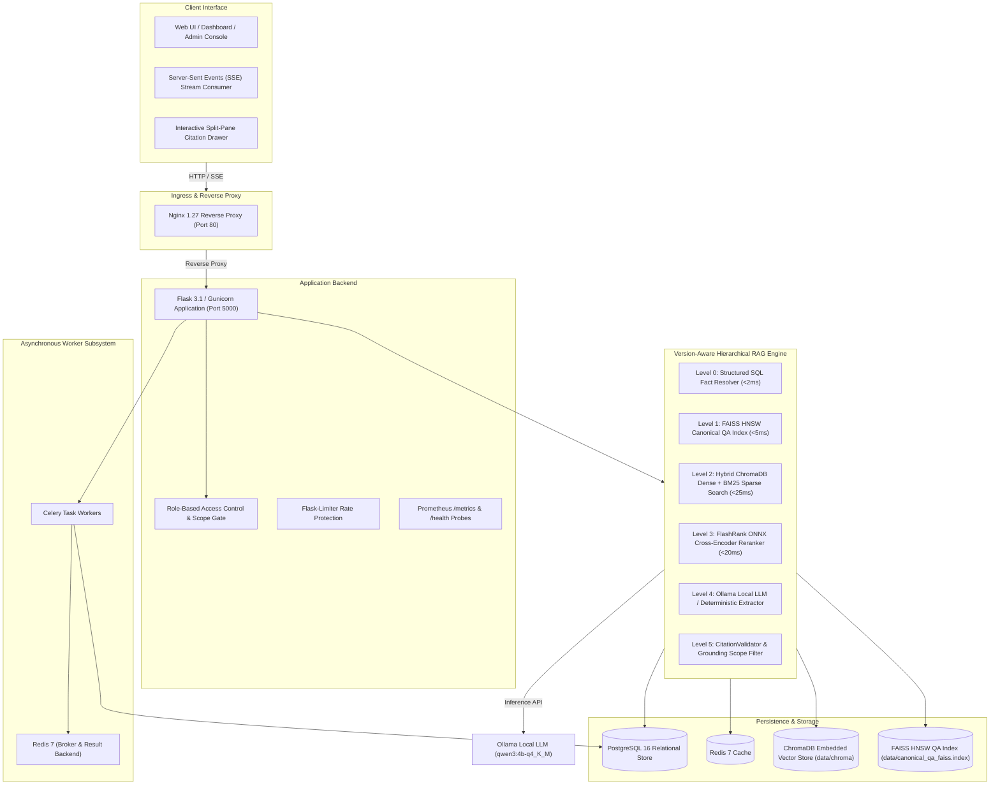

# Production Architecture & Deployment Specification: Policy Ledger Enterprise

This document describes the production architecture of **Policy Ledger Enterprise**, a version-aware enterprise policy intelligence platform.

---

## 1. System Architecture Topology



---

## 2. Component Specifications

### 2.1 Ingress Tier (Nginx)
- **Container**: `policy_ledger_nginx`
- **Role**: Reverse proxy, static asset caching, rate-limit backup, and SSE stream handling.
- **Port**: Listens on port `80` (HTTP). TLS termination is managed upstream at the external load balancer.
- **Streaming Support**: `proxy_buffering off` and `chunked_transfer_encoding on` for instant SSE token delivery.

### 2.2 Application Backend (Flask + Gunicorn)
- **Container**: `policy_ledger_web`
- **WSGI Server**: Gunicorn with 4 workers, bound to `127.0.0.1:5000`.
- **Security & Authorization**: Strict RBAC authorization enforcement via `QueryScope` and `EvidenceFilter`.
- **Probes**: `/health/live` (liveness), `/health/ready` (readiness verifying database connectivity), `/metrics` (Prometheus metrics).

### 2.3 Storage & Caching Layer
- **PostgreSQL 16**: Primary relational database storing policies, revisions, audit logs, facts, and users (`policy_ledger_postgres`).
- **Redis 7**: High-speed task broker for Celery and in-memory rate-limiter backend (`policy_ledger_redis`).
- **ChromaDB**: Embedded vector database storing 384-dimensional dense chunk embeddings with metadata isolation.
- **FAISS HNSW**: Fast ANN index for precomputed canonical questions with segment overlay and tombstone support.

### 2.4 AI, Retrieval & Inference Engines
- **Embedder**: FastEmbed ONNX runtime executing `BAAI/bge-small-en-v1.5` (384 dimensions, CPU optimized).
- **Reranker**: FlashRank ONNX runtime executing `ms-marco-TinyBERT-L-2-v2` cross-encoding over candidate chunks.
- **Sparse Retrieval**: Partitioned BM25 keyword matching using `rank-bm25`.
- **Local LLM Backend**: Ollama container (`policy_ledger_ollama`) serving `qwen3:4b-q4_K_M`.

---

## 3. Production Deployment & Verification

### 3.1 Launching the Stack
```bash
# 1. Configure environment variables in .env
cp .env.example .env

# 2. Build and launch all services
docker compose up -d --build

# 3. Pull required LLM model in Ollama
docker exec -it policy_ledger_ollama ollama pull qwen3:4b-q4_K_M

# 4. Seed initial database and knowledge base
docker exec -it policy_ledger_web python seed.py
```

### 3.2 Health & Diagnostic Checks
```bash
# Check service health
docker compose ps

# Verify liveness & readiness
curl -f http://localhost/health/live
curl -f http://localhost/health/ready
```

### 3.3 Running Automated Test Suite
```bash
# Run complete test suite in Docker
docker exec -it policy_ledger_web pytest -q

# Or run locally in python virtual environment
pytest -q
```
