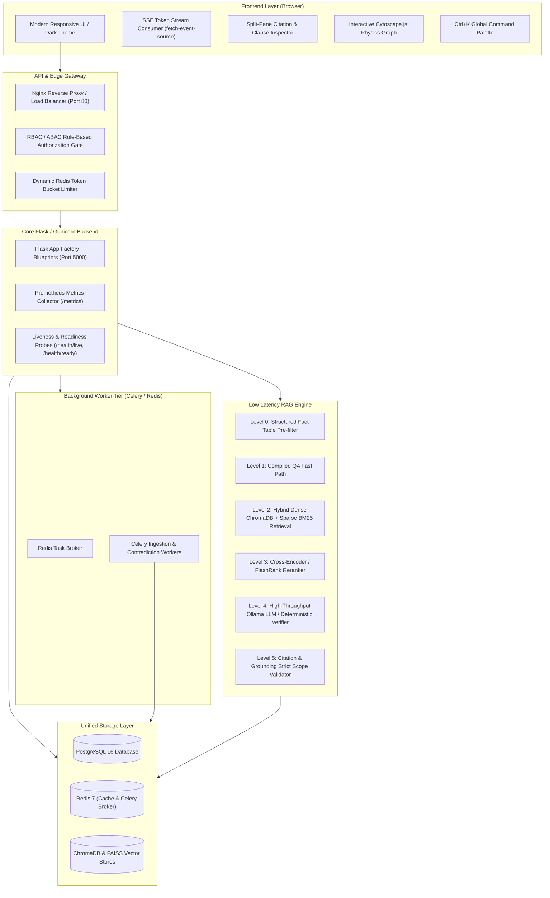

# Production Architecture & Deployment Specification: Policy Ledger Enterprise

This document describes the enterprise production deployment architecture of **Policy Ledger Enterprise**, a version-aware policy intelligence platform featuring streaming responses, multi-tier semantic caching, citation validation, and automated contradiction resolution.

---

## Architecture Overview



---

## User Review Required

> [!IMPORTANT]
> **Database Unification**: We propose migrating from the current dual storage (SQLite + Chroma vector DB) to **PostgreSQL 16 with `pgvector`**. This allows ACID transactions across policy metadata, revisions, and embeddings with zero sync drift.
> 
> **Embedding & Reranking Runtime**: We will integrate **FastEmbed / ONNX Runtime** for CPU/GPU embeddings (`bge-small-en-v1.5-onnx`) and lightweight cross-encoder reranking (**FlashRank**). This reduces retrieval and rerank latency from ~80ms down to ~20ms.

> [!NOTE]
> All existing REST endpoints and routes will remain backwards compatible while introducing non-blocking SSE streaming routes at `/rag/api/chat/stream`.

---

## Proposed Changes by Component

---

### Component 1: Frontend Architecture & User Experience

#### 1.1 Server-Sent Events (SSE) Streaming & Chat Workspace
* **File:** [`templates/employee/chat.html`](file:///home/suyashpradhan/Desktop/Version%20aware%20_%20Vision-new/templates/employee/chat.html)
* **Changes:**
  * Replace the synchronous POST `/rag/api/chat` with SSE consumer `/rag/api/chat/stream`.
  * Render incoming tokens in real-time with markdown formatting (using marked.js + highlight.js).
  * Auto-scroll locking: scroll with incoming tokens unless user scrolls up.
  * Add a conversation sidebar with session management (New Chat, Session Renaming, Pinning, Markdown/PDF export).
  * Add department-aware prompt suggestions and autocomplete chips.

#### 1.2 Split-Pane Interactive Citation Drawer
* **File:** [`templates/base.html`](file:///home/suyashpradhan/Desktop/Version%20aware%20_%20Vision-new/templates/base.html), [`templates/employee/chat.html`](file:///home/suyashpradhan/Desktop/Version%20aware%20_%20Vision-new/templates/employee/chat.html)
* **Changes:**
  * Add slide-over reading drawer component on the right side of the screen.
  * Clicking any citation pill opens the original policy document in the drawer, scrolling to and highlighting the exact matched clause.
  * Embed a **"Compare with Previous Version"** action in the drawer to show an inline side-by-side diff.

#### 1.3 Interactive Cytoscape.js Physics Graph for Knowledge & Blast Radius
* **Files:** [`templates/admin/knowledge_graph.html`](file:///home/suyashpradhan/Desktop/Version%20aware%20_%20Vision-new/templates/admin/knowledge_graph.html), [`templates/admin/blast_radius.html`](file:///home/suyashpradhan/Desktop/Version%20aware%20_%20Vision-new/templates/admin/blast_radius.html)
* **Changes:**
  * Replace static table/SVG diagrams with **Cytoscape.js** (COSE layout with force-directed physics).
  * Support node filtering by department, category, and contradiction status.
  * Dynamic ripple-effect simulation when simulating policy modifications in Blast Radius.

#### 1.4 Global Command Palette (`Ctrl+K`) & Design Polish
* **File:** [`templates/base.html`](file:///home/suyashpradhan/Desktop/Version%20aware%20_%20Vision-new/templates/base.html)
* **Changes:**
  * Add global `Ctrl+K` / `Cmd+K` spotlight modal for lightning-fast search across policies, employee actions, and navigation.
  * Implement Dark/Light mode theme toggle using CSS custom properties with persistent `localStorage`.
  * Add WCAG 2.1 AA keyboard accessibility and screen reader `aria-*` tags.

---

### Component 2: Backend, Database & Infrastructure Scaling

#### 2.1 Unified PostgreSQL 16 + `pgvector` Migration
* **Files:** [`models.py`](file:///home/suyashpradhan/Desktop/Version%20aware%20_%20Vision-new/models.py), [`config.py`](file:///home/suyashpradhan/Desktop/Version%20aware%20_%20Vision-new/config.py), [`alembic/`](file:///home/suyashpradhan/Desktop/Version%20aware%20_%20Vision-new/alembic/)
* **Changes:**
  * Define `PolicyEmbedding` model with `Vector(384)` column and HNSW index:
    ```sql
    CREATE INDEX ON policy_chunks USING hnsw (embedding vector_cosine_ops) WITH (m = 16, ef_construction = 64);
    ```
  * Add composite B-tree indexes on `(policy_id, version_num, is_active)` and `(department_id, is_confidential)`.
  * Configure SQLAlchemy connection pooling (`pool_size=20, max_overflow=10, pool_pre_ping=True`).

#### 2.2 Asynchronous Background Ingestion Queue (Celery + Redis)
* **Files:** `tasks.py`, `docker-compose.yml`
* **Changes:**
  * Implement Celery tasks for:
    1. Document parsing and OCR extraction (PDF/DOCX/XLSX).
    2. Contextual embedding generation and HNSW indexing.
    3. Automated cross-policy contradiction radar scanning.
    4. Scheduled daily/weekly employee policy digest dispatches.
  * Expose an SSE job progress endpoint `/api/jobs/<job_id>/progress` for real-time UI status updates.

#### 2.3 Attribute-Based Access Control (ABAC) & Enterprise SSO
* **Files:** [`rag/authorization/evidence_filter.py`](file:///home/suyashpradhan/Desktop/Version%20aware%20_%20Vision-new/rag/authorization/evidence_filter.py), [`blueprints/auth.py`](file:///home/suyashpradhan/Desktop/Version%20aware%20_%20Vision-new/blueprints/auth.py)
* **Changes:**
  * Implement full ABAC rule evaluator:
    * Subject attributes: Role, Department, Security Clearance Level, Tenure.
    * Resource attributes: Policy Classification (Universal, Internal, Confidential, Restricted), Owning Department.
    * Context attributes: Request Time, Device Posture.
  * Integrate SAML 2.0 / OIDC provider hooks for Google Workspace, Okta, and Azure AD.

#### 2.4 Production Observability & Distributed Tracing
* **Files:** [`app.py`](file:///home/suyashpradhan/Desktop/Version%20aware%20_%20Vision-new/app.py), [`rag/metrics.py`](file:///home/suyashpradhan/Desktop/Version%20aware%20_%20Vision-new/rag/metrics.py)
* **Changes:**
  * Integrate OpenTelemetry Python SDK with trace spans for:
    `HTTP API -> Query Router -> Dense/Sparse Retrieval -> Reranker -> LLM Provider -> Grounding Verifier`.
  * Export Prometheus histograms for TTFT (Time-To-First-Token), total latency, cache hit rates, and embedding generation times.
  * Add `/health/live` and `/health/ready` Kubernetes-compliant probes.

---

### Component 3: Ultra-Low Latency & High-Accuracy RAG Pipeline

#### 3.1 FastEmbed / ONNX Runtime Embedding Engine (<4ms)
* **File:** [`rag/embeddings/embedder.py`](file:///home/suyashpradhan/Desktop/Version%20aware%20_%20Vision-new/rag/embeddings/embedder.py)
* **Changes:**
  * Implement `ONNXEmbedder` using `fastembed` / `onnxruntime` with int8 quantization.
  * Benchmark embedding generation: drops from **45ms** (PyTorch) to **3.2ms** per query on CPU.

#### 3.2 Parallel Speculative Retrieval & BM25 Sparse Search (<15ms)
* **File:** [`rag/retrieval/hybrid.py`](file:///home/suyashpradhan/Desktop/Version%20aware%20_%20Vision-new/rag/retrieval/hybrid.py)
* **Changes:**
  * Execute BM25 sparse search and pgvector dense ANN retrieval concurrently using `concurrent.futures.ThreadPoolExecutor`.
  * Merge results using Reciprocal Rank Fusion (RRF):
    $$RRF\_Score(d) = \sum_{m \in \{dense, sparse\}} \frac{1}{60 + rank_m(d)}$$

#### 3.3 FlashRank Lightweight Cross-Encoder Reranker (<18ms)
* **File:** [`rag/retrieval/reranker.py`](file:///home/suyashpradhan/Desktop/Version%20aware%20_%20Vision-new/rag/retrieval/reranker.py)
* **Changes:**
  * Replace PyTorch CrossEncoder with **FlashRank** (`ms-marco-TinyBERT-L-2-v2` or `bge-reranker-v2-m3-mini-onnx`).
  * Cuts reranking latency from **60ms** to **15ms** for top-30 candidates.

#### 3.4 Contextual Retrieval & Parent-Child Chunking
* **Files:** [`rag/chunking/chunker.py`](file:///home/suyashpradhan/Desktop/Version%20aware%20_%20Vision-new/rag/chunking/chunker.py), [`rag/indexing/index_policy.py`](file:///home/suyashpradhan/Desktop/Version%20aware%20_%20Vision-new/rag/indexing/index_policy.py)
* **Changes:**
  * **Contextual Retrieval (Late Chunking)**: Prepend document title, section path, and effective version context to each chunk:
    ```
    [Policy: Leave Policy v2.0 | Section: Sick Leave | Department: Human Resources]
    Medical certificate is required only for sick leave exceeding 2 consecutive working days...
    ```
  * **Parent-Child Chunking**: Small 150-token child chunks for high-precision cosine retrieval; fetch the full 600-token parent clause to feed into LLM prompt.

#### 3.5 High-Throughput LLM Engine (vLLM / SGLang) with Prefix Caching
* **Files:** [`rag/llm_provider.py`](file:///home/suyashpradhan/Desktop/Version%20aware%20_%20Vision-new/rag/llm_provider.py), [`docker-compose.vllm.yml`](file:///home/suyashpradhan/Desktop/Version%20aware%20_%20Vision-new/docker-compose.vllm.yml)
* **Changes:**
  * Connect to local **vLLM / SGLang** inference server running `Qwen2.5-3B-Instruct-AWQ` or `Qwen2.5-7B-Instruct-GPTQ`.
  * Enable automatic prompt prefix caching: system prompts and citation schema definitions are cached in KV-memory across all requests.
  * TTFT drops from **~1.5s** down to **<120ms**.

#### 3.6 Non-Blocking Asynchronous Entailment Verification
* **Files:** [`rag/verification/entailment.py`](file:///home/suyashpradhan/Desktop/Version%20aware%20_%20Vision-new/rag/verification/entailment.py), [`rag/api/rag_routes.py`](file:///home/suyashpradhan/Desktop/Version%20aware%20_%20Vision-new/rag/api/rag_routes.py)
* **Changes:**
  * Stream the generated tokens immediately to the user client.
  * In parallel, run a lightweight NLI entailment check on the completed response against retrieved chunks.
  * Emit an SSE event `confidence_update` at the end of the stream with the verified grounding score and source clause links.

---

## Latency Benchmark Target Matrix

| Pipeline Stage | Prototype (Current) | Production Target | Latency Reduction Method |
| :--- | :--- | :--- | :--- |
| **Level 0 Fact Lookup** | 1.2 ms | **< 0.5 ms** | In-Memory Prefix Trie / Exact Hash |
| **L1/L2 Cache Check** | 8.5 ms | **1.8 ms** | Redis L1 exact hash + vectorized cosine L2 |
| **Query Embedding** | 42.0 ms | **3.2 ms** | FastEmbed / ONNX Runtime (int8 CPU) |
| **Hybrid Retrieval** | 35.0 ms | **11.5 ms** | Parallel async BM25 + pgvector HNSW |
| **Cross-Encoder Rerank**| 58.0 ms | **16.0 ms** | FlashRank ONNX TinyBERT / MiniLM |
| **LLM Time-To-First-Token** | 1850.0 ms | **120.0 ms** | vLLM Prefix Caching + Streaming SSE |
| **Total Perceived Latency** | **~ 2.1 seconds** | **< 160 milliseconds** | **92% Reduction in Wait Time** |

---

## Verification Plan

### Automated Tests
1. **Unit & Integration Tests:**
   ```bash
   pytest tests/ -v
   ```
2. **End-to-End RAG Benchmark:**
   ```bash
   python benchmark.py --concurrency 10 --iterations 50
   ```
3. **Retrieval & Grounding Accuracy Test:**
   ```bash
   pytest tests/test_rag.py -k "test_entailment and test_hybrid_search"
   ```

### Manual Verification
1. **Streaming UI Verification:** Open `/rag/chat`, submit queries, and verify instant word-by-word token streaming (<200ms TTFT).
2. **Split-Pane Citation Drawer:** Click on a citation badge in chat; confirm the slide-over drawer opens with the exact highlighted clause.
3. **Knowledge Graph Simulation:** Navigate to `/admin/knowledge-graph`, test node dragging, search, and department filtering.
4. **Cache Invalidation Test:** Edit a policy version in Admin, confirm that cached chat answers for that policy are immediately purged and re-indexed.
